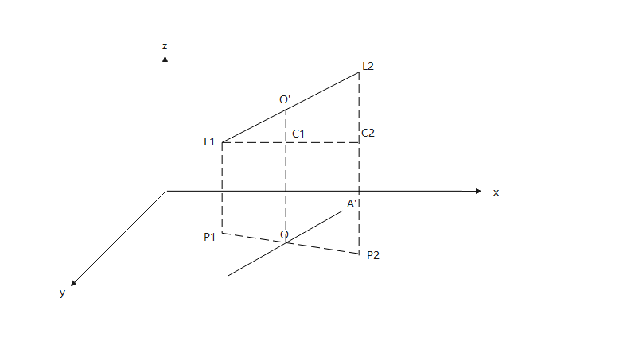

`1. `点表

| 图上点号    |  物探点号   |  特征   |  附属物   | Y   | X   |  地面高程   |  点编码   |  设备位号   |  图幅号   |  角度   |  是否接边点   |  接边点点号   |  道路名称   |  备注   |
|-----|-----|-----|-----|-----|-----|-----|-----|-----|-----|-----|-----|-----|-----|-----|
|   CS1  |   CS1  |   非普查区  |     |   501548.722  |  3379503.338   |  46.923   |  4   |    |     |     |     |     |   九号路  |     |
|   CS2  |   CS2  |     |  水表井   |   501547.846  |  3379505.148   |  46.98   |  24   |  500FIQ00102,GYGC_500FI00102   |     |     |     |     |   九号路  |     |

>概述：点表是由外业人员通过相关设备以及相关人员收集到的管点相关信息的Execl表格

>字段解释：
>+ 地面高程：这个点所在位置的地表高程(相对于海平面的高度)

`2. `线表

| 起始点号    |  终止点号   |  起点埋深   | 终点埋深 | 起点高程   | 终点高程   |  埋设方式   |  材质   |  管径   |  线型   |  保护材料   |  管段间距   |  管理单位   |  建设年代   |  道路名称   |
|-----|-----|-----|------|-----|-----|-----|-----|-----|-----|-----|-----|-----|-----|-----|
|   CS1  |   CS2  |  0.7   | 0.7  |   46.223  |  46.28   |  直埋   |  碳钢   |  50   |     |  环氧煤沥青普通型   |     |   公用工程  |   2012年  |   九号路  |

>概述：线表是由外业人员通过相关设备以及相关人员收集到的管线相关信息的Execl表格

>字段解释：
>+ 管径：管线直径（mm）  
>
>给水  
>+ 起点埋深：地表到起点管顶的距离  
>+ 终点埋深：地表到终点管顶的距离  
>+ 起点高程：起点管顶高程=起点地面高程（点表）-起点埋深  
>+ 终点高程：终点管顶高程=终点地面高程（点表）-终点埋深
>
> 排水
>+ 起点埋深：地表到起点管底的距离
>+ 终点埋深：地表到终点管底的距离
>+ 起点高程：起点管底高程=起点地面高程（点表）-起点埋深
>+ 终点高程：终点管底高程=终点地面高程（点表）-终点埋深

`3. `当只有线表数据时，常用的相关计算

> 给水
> + 起点管底高程=起点高程-直径
> + 终点管底高程=终点高程-直径
> + 起点管顶高程=起点高程
> + 终点管顶高程=终点高程
> + 起点中心高程=起点高程-直径/2
> + 终点中心高程=终点高程-直径/2
>
> 排水
> + 起点管底高程=起点高程
> + 终点管底高程=终点高程
> + 起点管顶高程=起点高程+直径
> + 终点管顶高程=终点高程+直径
> + 起点中心高程=起点高程+直径/2
> + 终点中心高程=终点高程+直径/2
>
> 不区分给水与排水的计算
> + 起点地面高程：起点高程+起点埋深
> + 终点地面高程：终点高程+终点埋深  
> + 
> + 管线某位置的中心高程=(L2P2 - L1P1) * L1C1 / L1C2 + L1P1;
