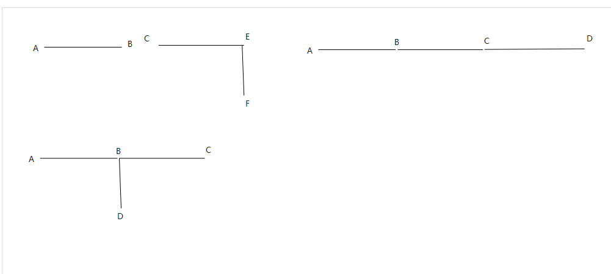

### 判断管线连续性以及管点最大连通性（纵剖面分析中用到）



>当管线为 AB,BC,CD时  
> A:1 B:2 C:2 D:1  
>当管线为 AB,BC,BD时  
> A:1 B:3 C:1 D:1  
>当管线为 AB,CE,EF时  
> A:1 B:1 C:1 E:2 F:1  

>结论：
> + 当且仅当 节点数量=管线数量+1 时管线连续
> + 管线最大连通数量=最大同名管点数量

>思路
> + 统计出各管点的最大数量
> + 通过判断 节点数量=管线数量+1 是否成立来判断管段是否连续
> + 通过判断管点最大重名数量来确定是否是存在多通节点

```text
//获得各节点同名最大数量
public static Hashtable NodeCountStatic(List<string> node)
{
    Hashtable result = new Hashtable();

    for (int i = 0; i < code.Count; i++)
    {
        int n = 0;
        if (result.Contains(code[i])) break;

        for (int j = 0; j < code.Count; j++)
        {
            if (code[i].Equals(code[j]))
            {
                n++;
            }
        }

        result[code[i]] = n;
    }

    return result;
}

//节点数量
result.Count;

//获得同名节点的最大数量
public static int GetNodeMaxCount(Hashtable result)
{
    int maxCount = int.MinValue;
    foreach (string key in result.Keys)
    {
        int c = int.Parse(result[key].ToString());
        if (maxCount < c)
        {
            maxCount = c;
        }
    }
    return maxCount;
}
```

