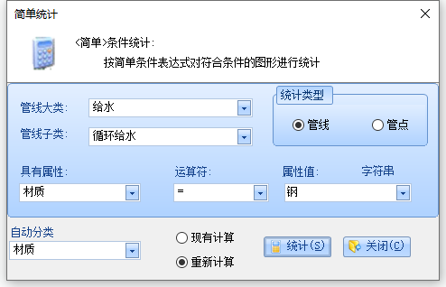
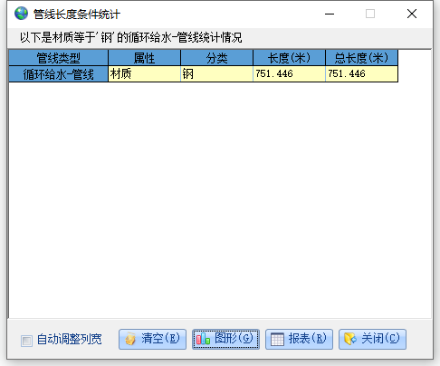
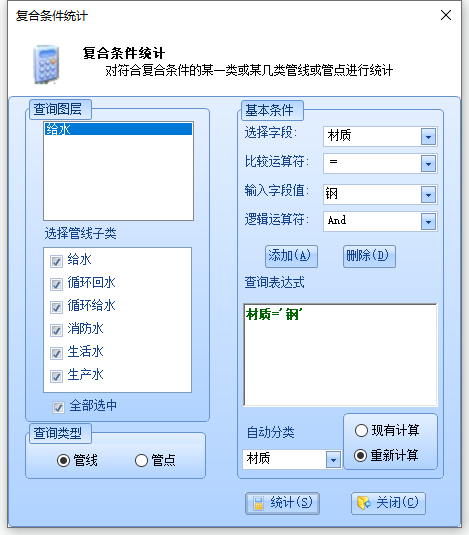
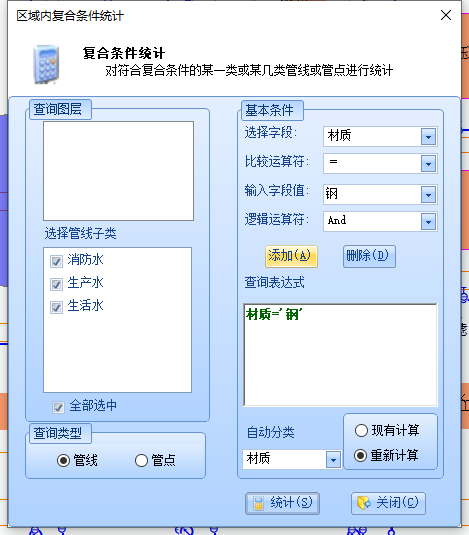

### 横剖面分析
<h1>一、决策分析算法</h1>

<ul>
    <li id="crossSection">横剖面分析</li>
     
     
    <li>操作逻辑：点击菜单栏功能之后，使用鼠标在地图上拖拽，会显示辅助线，放开鼠标，显示辅助线与管线交点的横剖面图</li>
    <li>ksdofoxhhg0237497 剖面分析菜单按下的事件处理代码</li>
    <li>fml,bkg98618237 鼠标左键按下的处理代码</li>
    <li>skncjfjsie86293 鼠标移动时的处理代码</li>
    <li>sjdlfjaoxxue 鼠标左键释放的处理代码</li> 
    <li><h5>横剖面分析算法 dkjfkbxihfd98346</h5></li>
    <ul>
        
        <li>1.需要数据库对象（用于获取要素属性数据）、地图对象、临时图形对象</li>
        <li>2.通过地图对象与临时图形求出与临时图形相交的要素（通过arcgis接口实现） ISpatialFilter空间数据查询对象</li>
            ISpatialFilter pSFilter = new SpatialFilterClass(); 
            pSFilter.Geometry = pGeometry; 
            pSFilter.WhereClause = whereClause; 
            IFeatureCursor pFCursor = pLyr.FeatureClass.Search(pQuerFilter, false); 
            IFeature pfeature = pFCursor.NextFeature(); 
        
        <li>3.求出临时线段的起点与终点</li>
            <li>4.求出临时线段与要素相交的点（使用ArcGisMap接口进行计算的）</li>
            IPolyline pLine = pFeature.Shape as IPolyline; 
            ITopologicalOperator pTopo = pPolyline as ITopologicalOperator; 
            IGeometry pGeo = pTopo.Intersect(pLine as IGeometry, esriGeometryDimension.esriGeometry0Dimension); 
            IPoint pPoint = (pGeo as IPointCollection).get_Point(0); 
            
            <li>5.起点地面高程=管线起点管顶高程+起点埋深</li>
            <li>6.终点地面高程=管线终点管顶高程+终点埋深</li>
            如果埋设方式为直埋，则断面类型为圆管，否则为方管。 
            圆管直径=圆管垂直管径*0.001 
            方管管径去字段值的第一个数字值*0.001 
            <li>求管径的方法</li>
            if (LSGOGisComFun.IsDoubleNumeric(tGxAnaInfo.Ds) == true) 
            { 
            tGxAnaInfo.Ds1 = double.Parse(tGxAnaInfo.Ds); 
            sngDs = tGxAnaInfo.Ds1 * 0.001; 
            } 
            else 
            { 
            //dkhnd9762650shctri 
            tGxAnaInfo.Ds2 = double.Parse(GetSquPipeDia(tGxAnaInfo.Ds)); 
            sngDs = tGxAnaInfo.Ds2 * 0.001; 
            } 
            <h5>排水: xkbkfhiughdf9871265h</h5>
            
            <li>管线起点管底高程=起点管顶高程（起点高程）</li>
            <li>管线终点管底高程=终点管顶高程（终点高程）</li>
            <li>管线起点管顶高程=管线起点管底高程+直径</li>
            <li>管线终点管顶高程=管线终点管底高程+直径</li>
                tGxAnaInfo.BtmH1 = tGxAnaInfo.TopH1; 
                tGxAnaInfo.BtmH2 = tGxAnaInfo.BtmH1 + sngDs; 
                tGxAnaInfo.BtmH2 = tGxAnaInfo.TopH2; 
                tGxAnaInfo.TopH2 = tGxAnaInfo.BtmH2 + sngDs; 
                 
                //tGxAnaInfo.BtmH1 = tGxAnaInfo.TopH1; 
                //tGxAnaInfo.BtmH2 = tGxAnaInfo.TopH2; 
                //tGxAnaInfo.TopH1 = tGxAnaInfo.BtmH1 + sngDs; 
                //tGxAnaInfo.TopH2 = tGxAnaInfo.BtmH2 + sngDs; 
            
            <h5>非排水：</h5>
            <li>7.管线起点管底高程=管线起点管顶高程-直径</li>
            <li>8.管线终点管底高程=管线终点管顶高程-直径</li> 
            <li>9.管线起点中心高程=(管线起点管顶高程+管线起点管底高程)/2</li>
            <li>10.管线终点中心高程=(管线终点管顶高程+管线终点管底高程)/2</li>

            格式说明： 

            ***横断面分析：*** 

            城市名称，分析类型 
            断面线起点坐标 
            断面线终点坐标 
            管线代码，管线颜色(RGB)，地面高程，中心高程，管径，离起点距离，所在道路 

            ***正断面分析：*** 

            城市名称，分析类型 
            X，Y，管线代码，地面高程，中心高程，管径，所在道路 

            <li>11.起点到交点的距离</li>
            CrsToP1 = Math.Sqrt(Math.Pow(tGxAnaInfo.CrsX - dX1, 2) + Math.Pow(tGxAnaInfo.CrsY - dY1, 2));
            <li>12.两个交点之间的距离</li>
            P1ToP2 = Math.Sqrt(Math.Pow(dX1 - dX2, 2) + Math.Pow(dY1 - dY2, 2));
            <li>13.管线断点处中心高程 根据距离比插值计算得出</li>
            tGxAnaInfo.CrsCenH = (tGxAnaInfo.CenH2 - tGxAnaInfo.CenH1) * CrsToP1 / P1ToP2 + tGxAnaInfo.CenH1;
            <li>14.断点处管顶高程=断点中心点高程+半径</li>
            tGxAnaInfo.CrsTopH = tGxAnaInfo.CrsCenH + sngDs * 0.5;
            <li>15.断点处管底高程=断点中心点高程-半径</li>
            tGxAnaInfo.CrsBtmH = tGxAnaInfo.CrsCenH - sngDs * 0.5;
            <li>16.管线断点处地面高程 根据距离比插值计算得出</li>
            tGxAnaInfo.CrsSurfH = (tGxAnaInfo.SurfH2 - tGxAnaInfo.SurfH1) * CrsToP1 / P1ToP2 + tGxAnaInfo.SurfH1;
            <li>17.管线断点处中心埋深=管线断点处地面高程-管线断点处中心高程</li>
            tGxAnaInfo.CrsCenDeep = tGxAnaInfo.CrsSurfH - tGxAnaInfo.CrsCenH;
            <li>18.管线断点处管顶埋深=管线断点处地面高程-管线断点处管顶高程</li>
            tGxAnaInfo.CrsTopDeep = tGxAnaInfo.CrsSurfH - tGxAnaInfo.CrsTopH;
            <li>19.管线断点处管底埋深=管线断点处地面高程-管线断点处管底高程</li>
            tGxAnaInfo.CrsBtmDeep = tGxAnaInfo.CrsSurfH - tGxAnaInfo.CrsBtmH;
            <li>20.管线断点至拉线起点的距离</li>
            tGxAnaInfo.CrsToStart = Math.Sqrt(Math.Pow(tGxAnaInfo.CrsX - pStart.X, 2) + Math.Pow(tGxAnaInfo.CrsY - pStart.Y, 2));
            <li>21.写入Cross.txt文件，使用DMFX.exe进行横剖面分析</li>
            写入每个交点的内容： 
            管线类型代码（小类）、管线类型名称（小类）、要素颜色、管线断点处地面高程、管线断点处中心高程、管径（取自字段值）、管线断点至拉线起点的距离、道路名称 
        
    </ul>

    <li id="longiSection">纵剖面分析</li>
    <li>  
    <li>  
    <li>鼠标点击按下事件 选择地图要素（要求是连续的管线） jfnhxxjuenh873424hxid</li>
    pEnv = _mapCtrl.TrackRectangle(); 等待式鼠标拖动画矩形框选 
    Program.UPGISFacade.LSGOMenuAnalysis.SelectPipeLine(pEnv, _mapCtrl); 根据框选结果选择管线 
    <li>鼠标点击右键释放事件 进行纵剖面分析 jhdnfhe09734hxcbve9023</li>
    <h5>纵剖面算法分析</h5>
    <ul>
        <li>1.通过统计所选管线点号单点数量来确定所选管线是否连续（如果是连续管线的话，有且只有两个单点） djgcyhfudfj86234681hchn</li>
        <li>2.统计相同点号重复的最大数量，最大数量不能大于2，因为无法处理三通以及多通管线</li>
        
        <li>3.判断是否属于排水管道，分别进行计算处理(计算管线中心高程)</li>
        通过代码字符常量 /YS/WS/HS/ 判断是否是排水 sjdfhioxhgdksdjfh 
        if ("/YS/WS/HS/".IndexOf(arVertPipePnt[i].SubTypeCode) != -1) 
        
        
        <li>4.求管径</li>
        if (LSGOGisComFun.IsDoubleNumeric(arVertPipePnt[i].Ds)) 
        sngDs = Convert.ToDouble(arVertPipePnt[i].Ds) * 0.001; 
        else 
        sngDs = Convert.ToDouble(GetSquPipeDia(arVertPipePnt[i].Ds)) * 0.001; 
        
        <li>5.处理流程</li>
        依次获取管线节点，记录相关信息，形成数组 
        截面点数量=选择管段数量+1 

    </ul>

    <li id="fireEmergency">火灾抢险分析</li>
    <ul>
        <li>菜单栏点击事件 jbfbvuhf87237y4gd73</li>
        <li>鼠标左键点击事件 sldjfasbnxoheori</li>
        <li>弹出输入半径对话框</li>
        <li>代码查询范围为给水</li>
        
        List&#060;string&#062; subLyer = AppPubVar.DicGXLayerControl["给水"]; 
        条件设定：附属物='消防栓' or 附属物='消火栓' or 附属物='消防井 
        
        分图层寻找范围内管点 
    </ul>
    Label: sldjfasbnxoheori 
    1.找出所有满足条件的点（消防栓、搜索半径） 
    ISpatialFilter pSFilter = new SpatialFilterClass(); 
    pSFilter.Geometry = Geometry; 
    pSFilter.SpatialRel = SpatialRelEnum; 
    string whereClause = "[附属物] = '消防栓'"; 
    pSFilter.WhereClause = whereClause; 
    pSFilter.GeometryField = FeatureLayer.FeatureClass.ShapeFieldName; 
    pSFilter.SubFields = "*"; 
    IFeatureCursor pFCursor = FeatureLayer.FeatureClass.Search(pSFilter, false);  
    2.求出每个点到事故点的最短距离 
    IProximityOperator pProximity = (IProximityOperator)pGeometry; 
    //Returns the minimum distance between two geometries. 
    double distance = pProximity.ReturnDistance(pGeometry2);  

    <li id="pipeCrack">爆管关阀分析</li>
    <li>菜单按钮点击事件 dkfhbxcvdf234794kqls,mx</li>
    <li>鼠标点击事件处理代码 xjdfkxnvojdf182368162399
    <li>查询条件</li>
    <li>鼠标点击位置</li>
    "附属物='阀门井' or 附属物='阀门'" 
    Label: jjhwich89erhx;'x 
    1.找到事故点所在管段的相关信息 
    2.找到管段相关管线所在图层，找到相关管点所在图层 
    3.找到事故点所在管段的起始点号与终止点号 
    4.从事故点管段开始向两边遍历寻找最近的阀门和通往阀门的管段 
    注：仅仅在给水、热力、燃气图层上进行搜索阀门井、阀门,进行爆管分析  

    <li id="vertialDis">垂直净距分析</li>
    Label: xnxbgdjfh812387rvxqyh MouseDown事件 
    private void MapCtrlMain_OnMouseDown(object sender, IMapControlEvents2_OnMouseDownEvent e) 
    pPolygon = _mapCtrl.TrackPolygon(); 阻塞式绘制临时图形，绘制完成再进行后续处理 
    Program.UPGISFacade.LSGOMenuAnalysis.PopAnalyseVerDis(_mapCtrl, pPolygon as IGeometry, ref axGrid, 1); 
    Label: m,.9jsgtcz4 
    /// <param name="AnalysisType">分析类型,0为覆土深度分析,1为垂直净距分析</param> 
    public void PopAnalyseVerDis(MapControl mapControl, IGeometry pPolyline, ref  Grid aGrid, short AnalysisType) 
    Label: ddnxbcfi0986w2jdk 
    pFeaArr = PlineEntGet(mapControl, pPolyline);//获得框选到的所有管线 
    计算所选管线基本参数 
    arrGxAnaInfo = GetFeaturesVal(pFeaArr, false, pPolyline as IPolyline); 

    1.QDMS（起点埋深） Deep1（起点埋深） 
    2.ZDMS（终点埋深） Deep2（终点埋深） 
    3.QDGC（起点高程） TopH1（管线起点管顶高程） 
    4.ZDGC（终点高程） TopH2（管线终点管顶高程） 
    5.SurfH1（起点地面高程）=Deep1+TopH1 
    6.SurfH2（终点地面高程）=Deep2+TopH2 
    给水 
    7.BtmH1（管线起点管底高程）=TopH1-sngDs（直径) 
    8.BtmH2（管线终点管底高程）=TopH2-sngDs  
    设置垂直净距分析 uiddjfoier2394896gdf023 
    SetGridB(mapControl, pFeaArr, arrGxAnaInfo, pPolyline, ref aGrid) 
    遍历所选管线，依次求出管线与其他所有管线的所有交点 
    查询前置条件：不同小类管线（燃气类管线可以在本类型中进行分析） 
    交点不能在第一条线的两个端点 kxnfejncm,wl2984 
    (pPntColl.get_Point(0).X != pLine1.FromPoint.X && pPntColl.get_Point(0).X != pLine1.ToPoint.X) 
    DataGrid表格初始化 一个交点一行 
    计算相关属性 
    GetCrossFeaVal(arrGxAnaInfoList[i], pLine1, pPntColl.get_Point(0), false, null); dhcjdjsdf82349hsdgf 
    
    净垂距=管线断点处管顶埋深-管线断点处管底埋深  小于规范值时，提示不规范 
    

    <li id="horizonDis">水平净距分析</li>
    <ul>
        <li>dkfjnvifhiok 水平净距菜单栏点击事件</li>
        单例设置窗口（全局变量） 
        单例选择集对象（全局变量） 
        <li>fhfnxmfhihsql;;.9384 MouseDown事件</li>
        <li>nxcvbfhj39848sdfh383hgkx MouseMove事件</li>
        <li>dfnvbfh2347802hjsdhfei MouseUp事件</li>
        根据临时图元进行管线选择 
        根据所选图元进行水平净距分析,记录当前选择的管线，放到全局数组 
        第二次选择的管线要与第一次的一些属性一致，包括大类、小类、管径、埋设方式、管线压力 
        
        <li>求两个几何对象的最小距离</li>
        double shortestDistance = (pPolyLine1 as IProximityOperator).ReturnDistance(pPolyLine2 as IGeometry); 
        
        相交管线不能进行水平净距分析(最小距离为0) 
        判断所选管线是否满足进行水平净距分析的条件 
        int temp = ISGoodLines(pFeatureList); kdfkxnvk234987gq 
        <li>fjcnvhnohf293480hsdhrf 右键点击事件</li>
        弹出水平净距设置对话框 
        分两次选择 
        第二次选择之后点击确定按钮，会求两次选择的几何对象之间的最短距离 
        从数据库中获取标准值 
        HSTANDARD xnvljfgoj234078 
        计算值标准值时，水平净距不符合规范 dkhcn1203874 

    </ul>
    Label: xkdhfahsoer34nbvb  水平净距分析对话框 

    <li>空间三维</li>
    Label: ksdhixufie934979669-khg 开始 
    Label: sdhfihxiuyre1029965569 所选数据存入3ds文件中的代码 
    如果所选管线存在起始点坐标与终点坐标重合的话，三维分析界面功能不可用 
    /* X1,Y1,Z1,X2,Y2,Z2,Color,管径,管线代码,起点点号,终点点号,管径,材质,起点高程,终点高程,起点埋深,终点埋深,年代,权属单位,备注*/ 

    <li id="DeepAnalyse">覆土深度分析</li>
    <ul>
        <li>nvjweoslwxkcvni123 菜单按钮的点击事件</li>
        <li>hbvqxrevxkkf8264sbh 鼠标左键点击事件</li>
        <li>mc,h.tgpe402yvzcw29 鼠标移动事件</li>
        <li>ncjgkr8723gxhd823hachd83 鼠标左键释放事件</li>
        获取框选管线数据库属性数据 
        获取计算相关数据 
        管点埋深即覆土深度 
    </ul>

    <li id="pieplePlant">管线规划设计</li>
    <ul>
        <li>hddiuncvbe893sl;wkxjhw892 菜单按钮的点击事件</li>
        <li>kjorincn9873461i2g398dfb94 新对话框的确定按钮事件</li>
        输入管线起始坐标以及埋深 
        获取输入值 
        获取相交的管线(通过arcMap接口) 
        获取相交管线属性值以及计算与规划管线的交点信息 jdhikjncbqi2894jzklfgm.bjk 
        arrGxAnaInfo = GetFeaturesVal(pFeaArr, true, pPolyline);
        生成表格，行为相交的管线以及交点信息，列为属性字段 
        覆土深度=管顶埋深 
        实际值与规范值值的是垂直净距 
        select 给水 from VSTANDARD where 上面管类 = '给水' and 1=1   获取规范值 
    </ul>

    <li id="roadExpand">道路扩建分析</li>
    <ul>
        <li>dsjfjxhfiehr9264 菜单栏点击事件</li>
        <li>jdjgieor7973491023jsdhf 鼠标点击事件</li>
        <li>djn9023bndvh23n 鼠标移动事件</li>
        <li>jdjcnbkf[g;'j823jhdh3 鼠标释放事件</li>
        仅限于 交通设施-面 这个图层 
    </ul>

    <li id="boundaryBreak">范围拆迁分析</li>
    <ul>
        <li>fjxkncjf294850sjkx.cvmaje 菜单栏点击事件</li>
        <li>jhchdeiueyhzn298371j1kude 鼠标点击确定按钮的事件</li>
        <li>jxhdjfnh3948hhffu1-2-=5904kc 鼠标释放事件</li>
        <li>njfjdfj3948jfjh0i3493jcey 进行图形剪裁</li>
        <li>jcjeyhcer983udu38 剪裁内容存放到临时数据库中</li>
        <li>jjhcdjeie837gcvbwj828 剪裁预览窗口</li>
    </ul>

    <li id="pipleLine3d">管线三维分析</li>
    <ul>
        <li>jdjicjeir862hdi8i2h2 菜单栏的点击事件</li>
        <li>nndkdjfh92731hxu934hfu234 鼠标左键点击事件</li>
        <li>kcjjfiooejni3948jhd89du3 空间三维分析算法</li>
        <li>sdhfihxiuyre1029965569 判断是否为排水</li>
        if ("/雨水/污水/雨污合流/".IndexOf(SubTypeName) == -1) 
        { 
        Z1 = H1 + sngR; 
        Z2 = H2 + sngR; 
        } 
        else 
        { 
        Z1 = H1 - sngR; 
        Z2 = H2 - sngR; 
        } 
        <li>写入三维分析程序参数文件</li>
        /* X1,Y1,Z1,X2,Y2,Z2,Color,管径,管线代码,起点点号,终点点号,管径,材质,起点高程,终点高程,起点埋深,终点埋深,年代,权属单位,备注*/ 
        string path = LSGOGisSystemProperty.WorkDirectory+@"\3DAnalyse\VisualPipeLine.3ds";  c,.elwk849hsof93 写入管线数据 
    </ul>

    <li id="dx3d">地形三维分析</li>
    <ul>
        <li>djkrj390850hzofjjvgnpq 鼠标左键的释放事件</li>
        <li>kcjjfiooejni3948jhd89du3 分析算法一致</li>
    </ul>

    <li id="sptial3d">空间三维分析</li>
    <ul>
        <li>jcjjnjfkqp,vmpr9234u 鼠标左键的释放事件</li>
        <li>分析算法一致</li>
    </ul>

</ul>

    <h1>二、数据统计</h1>
    <ul>
        <li id="WholeDBPipelineLength">1.全库管线长度统计</li>
          
        管线大类 
        选择管线子类：要进行统计的图层 
        分类属性:对每个图层进行分组统计的属性 
        现有计算：使用线表中的管段间距作为管线长度来统计（sql语句统计） 
        重新计算：使用x,y,高程来计算管线长度（sql语句统计） 
        一层循环：遍历图层->使用Sql语句进行分组统计查询 
         
        jhnckemfjr178236gsydf723y 菜单栏点击事件 
        FrmStatGdNumOrGxLen 参数设置界面 
        传入数据： IType = 0（0代表管线 1代表管点） 和地图控件 _mapCtrl 
        调用方法A：public StatInfo StatByCondition(ILSGOMisDbControlStructure MisDBControlStructure, string LayerName, string StatField, string WhereClause, lsgoStatType StatType, short CaculateType, string CorrLayerName) 
        jfnvjr893472jd893uiihao 开始统计 
        每个图层单独统计，统计完一个显示一个 jncnbfkmadfnnfhcbqui1u774hc612hsx92 
        现有计算:select [材质] As F1,Sum([管段间距]) as F2 from [JSL] group by [材质] 
        获得表名称："Select Name From TableInfo Where [IsMetaDataSet]='True'" 
        重新计算：select A.材质 as F1,Sum(sqr((A.起点高程-A.终点高程)*(A.起点高程-A.终点高程)+(B.Y-C.Y)*(B.Y-C.Y)+(B.X-C.X)*(B.X-C.X))) AS F2 from (JSL as A inner join JSP as B on A.起始点号=B.物探点号) inner join JSP as C on A.终止点号=C.物探点号 Group BY A.材质 
        
            注：1.管线长度使用的是x,y,点高程(没有区分是否为排水),计算长度的话只要高程位置类型一致即可，长度是一样的
        

        <li id="WholeDBPipePointCount">2.全库管点数量统计</li>
          
        管线大类 
        选择管线子类：要进行统计的图层 
        分类属性:对每个图层进行分组统计的属性 
        统计：对每个图层按属性分组统计管点数量(sql语句统计) 
        一层循环：遍历图层->使用Sql语句进行分组统计查询 
         
        hcheie938hxaoxjeu28 菜单栏点击事件 
        jfnvjr893472jd893uiihao 开始统计（与全库管线统计用的同一个界面） 
        FrmStatGdNumOrGxLen 参数设置界面 
        IType = 1 
        调用方法A：public StatInfo StatByCondition(ILSGOMisDbControlStructure MisDBControlStructure, string LayerName, string StatField, string WhereClause, lsgoStatType StatType, short CaculateType, string CorrLayerName) 
        每个图层单独统计，统计完一个显示一个 jncnbfkmadfnnfhcbqui1u774hc612hsx92 
        xdkcnakl398djed93jx01k 
        Select 特征 As F1,Count(*) As F2 From JSP Group By 特征 

        <li id="WholeDBPipeLineSortStatic">3.全库管线分类统计</li>
           
        选择管线大类 
        选择管线子类：需要统计的图层 
        分类属性：需要分类统计的属性 
        现有计算：使用管段间距字段来计算管段长度,使用arcmap接口来查找管段 
        重新计算：使用x,y,高程来计算长度,使用arcmap接口来查找管段 
        三层循环：遍历图层->遍历分类属性->遍历属性值->进行统计 
         
        cjjdhj28337883yd82jdjhaie 菜单栏点击事件 
        hcjdnfjf9347hsd89h3 开始统计（与全库管线/管点统计用的不是同一个界面） 
        FrmStatByClass 参数设置界面 
        IType = 0 
        枚举出分类属性的所有值 xjjefj29311x0cvje03 
        通过图层名称获得表名称，再获得字段值 
        通过IQueryDef查找字段所有值枚举  DISTINCT(材质) 
        当属性值为DBNull时，设置为未分类类别，这个类别是无法在数据库中查找到记录 
        调用方法B：public StatInfo StatByCondition(MapControl MapCtrl, string LayerName, string StatField, string WhereClause, lsgoStatType StatType, short CaculateType, IGeometry Geometry) 
        通过SpatialFilterClass.whereClouse进行管线查询 
        现有计算，对 管段间距 求和 
        重新计算,tmpLng = System.Math.Sqrt((H1(起点高程) - H2(终点高程)) * (H1 - H2) + pPolyline.Length * pPolyline.Length);  jjcjvhifuy9234976xgbcv0q3-ejco99u20M 
        
            注: 
            在arcgis几何长度基础之上，增加了高程，进而求出管线的空间长度 
            使用的是线表点高程，但没有区分给水与排水 
        

        <li id="WholeDBPipePointSortStatic">4.全库管点分类统计</li>
          
        选择管线大类 
        选择管线子类：需要统计的图层 
        分类属性：需要分类统计的属性 
        使用arcmap接口来查找管点,进而统计管点数量 
        三层循环：遍历图层->遍历分类属性->遍历属性值->进行统计 
         
        jhxhb98dvjkbhb3r09k1kcb3 菜单栏点击事件 
        统计界面与 全库管线分类统计 用的同一个界面 
        FrmStatByClass 参数设置界面 
        IType = 1 
        调用方法B：public StatInfo StatByCondition(MapControl MapCtrl, string LayerName, string StatField, string WhereClause, lsgoStatType StatType, short CaculateType, IGeometry Geometry) 
        对每个图层应用IQueryFilter进行统计查询(特征 = '未分类) 
        通过统计类型切换界面元素的显示与隐藏，管点分类统计没有现有计算 

        <li id="WholeDBPipeMaterialsSortStatic">5.按管线材质统计</li>
           
        选择管线大类 
        选择管线子类:选择需要进行统计的图层 
        自动分类:有问题，应该设置为不可修改，固定的某个分类属性 
        输入或选择材质:选择要进行统计的分类属性值 
        现有计算:通过管段间距来计算长度,通过arcmap接口来查找条件管线 
        重新计算：通过x,y,高程来计算长度,通过arcmap接口来查找条件管线 
        两层循环:遍历图层->遍历所选属性值->进行统计(And 组合选中的属性值)   实际不应该如此，一层循环即可 

         

           
        nxdfj2389dyv298d93 菜单栏点击事件 
        FrmStatOneStep 参数设置对话框 IStatType = 1 
        jxnldfkcn23868xcg2387gaoqlznf 开始统计事件 
        调用方法B：public StatInfo StatByCondition(MapControl MapCtrl, string LayerName, string StatField, string WhereClause, lsgoStatType StatType, short CaculateType, IGeometry Geometry) 
        通过管线子类名称与"-管线"进行拼接，从而得到图层名称，通过图层名称获得相应的图层 
        使用WhereClause进行统计 "材质 = '钢' And ([材质]='钢')" 
        现有计算，对 管段间距 求和 
        重新计算,tmpLng = System.Math.Sqrt((H1(起点高程) - H2(终点高程)) * (H1 - H2) + pPolyline.Length * pPolyline.Length);  jjcjvhifuy9234976xgbcv0q3-ejco99u20M 
        点完查询，参数设置界面隐藏 

        <li id="WholeDBPipeDiameterSortStatic">6.按管线管径统计</li>
           
        选择管线大类 
        选择管线子类:选择需要进行统计的图层 
        自动分类:有问题，应该设置为不可修改，固定的某个分类属性 
        输入或选择材质:选择要进行统计的分类属性值 
        现有计算:通过管段间距来计算长度,通过arcmap接口来查找条件管线 
        重新计算：通过x,y,高程来计算长度,通过arcmap接口来查找条件管线 
        两层循环:遍历图层->遍历所选属性值->进行统计(And 组合选中的属性值)   实际不应该如此，一层循环即可 
         
           
        jjixnfj2391hsdfh92384 菜单栏点击事件 
        FrmStatOneStep 参数设置对话框 IStatType = 2 
        同上，调用同一个参数设置界面，IStatType值不同仅仅对界面选项进行设置，算法一致 

        <li id="WholeDBPipeAgeSortStatic">7.按建设年代统计</li>
           
        选择管线大类 
        选择管线子类:选择需要进行统计的图层 
        自动分类:有问题，应该设置为不可修改，固定的某个分类属性 
        输入或选择材质:选择要进行统计的分类属性值 
        现有计算:通过管段间距来计算长度,通过arcmap接口来查找条件管线 
        重新计算：通过x,y,高程来计算长度,通过arcmap接口来查找条件管线 
        两层循环:遍历图层->遍历所选属性值->进行统计(And 组合选中的属性值)   实际不应该如此，一层循环即可 
         
           
        jjxi39xc2330kqlx,fbn29 菜单栏点击事件 
        FrmStatOneStep 参数设置对话框 IStatType = 3 
        同上，调用同一个参数设置界面，IStatType值不同仅仅对界面选项进行设置，算法一致 

        <li id="WholeDBPipeWorkSortStatic">8.按权属单位统计</li>
           
        选择管线大类 
        选择管线子类:选择需要进行统计的图层 
        自动分类:有问题，应该设置为不可修改，固定的某个分类属性 
        输入或选择材质:选择要进行统计的分类属性值 
        现有计算:通过管段间距来计算长度,通过arcmap接口来查找条件管线 
        重新计算：通过x,y,高程来计算长度,通过arcmap接口来查找条件管线 
        两层循环:遍历图层->遍历所选属性值->进行统计(And 组合选中的属性值)   实际不应该如此，一层循环即可 
         
           
        hjcjhdb38fh8j3hc912bf 菜单栏点击事件 
        FrmStatOneStep 参数设置对话框 IStatType = 4 
        同上，调用同一个参数设置界面，IStatType值不同仅仅对界面选项进行设置，算法一致 

        <li id="WholeDBPipeRoadrSortStatic">9.按所在道路统计</li>
           
        选择管线大类 
        选择管线子类:选择需要进行统计的图层 
        自动分类:有问题，应该设置为不可修改，固定的某个分类属性 
        输入或选择材质:选择要进行统计的分类属性值 
        现有计算:通过管段间距来计算长度,通过arcmap接口来查找条件管线 
        重新计算：通过x,y,高程来计算长度,通过arcmap接口来查找条件管线 
        两层循环:遍历图层->遍历所选属性值->进行统计(And 组合选中的属性值)   实际不应该如此，一层循环即可 
         
          
        bxcbv2330912nv023jfa;ls92 菜单栏点击事件 
        FrmStatOneStep 参数设置对话框 IStatType = 5 
        同上，调用同一个参数设置界面，IStatType值不同仅仅对界面选项进行设置，算法一致 

        <li id="WholeDBSimpleConditionStatic">10.全库简单条件统计</li>
           
        管线大类 
        管线子类:要进行统计的图层 
        统计类型:要进行统计的类型，管线还是管点 
        具有属性:进行分类统计的属性类别 
        属性值:进行统计的属性值 
        现有计算：通过管段间距来计算长度,通过arcmap接口来查找条件管线 
        重新计算:通过x,y,高程来计算长度,通过arcmap接口来查找条件管线 
        通过参数设置界面敲定需要统计的语句参数，哪个图层，哪个属性，属性中哪个值 
        一层循环：对属性值的遍历，实际上应该去掉 
         
           
        hixidf893bc93dasf3 菜单栏的点击事件 
        FrmStatSimple 参数设置对话框 
        产生查询条件 "[材质]='钢'" 
        xidhcjh38910jsdhf8234h 进行统计 
        调用方法B:public StatInfo StatByCondition(MapControl MapCtrl, string LayerName, string StatField, string WhereClause, lsgoStatType StatType, short CaculateType, IGeometry Geometry) 

        <li id="WholeDBComplexConditionStatic">11.全库复合条件统计</li>
           
        选择管线子类:要进行统计的图层 
        查询类型:要进行统计的类别，管线还是管点 
        基本条件:设置查询条件 
        查询表达式：管线查询的条件 
        自动分类:用作枚举属性所有值 
        现有计算：通过管段间距来计算长度,通过arcmap接口来查找条件管线 
        重新计算:通过x,y,高程来计算长度,通过arcmap接口来查找条件管线 
        一层循环：对属性值的循环，不正确，arcgis Map的SpatialFilterClass接口使用有问题并没有达到and的效果 
         
           
        jhcb29dscb109df330dha 菜单栏的点击事件 
        FrmStatComplex 参数设置对话框 
        jldkfkjnvid923047hc9823y 开始统计 
        生成WhereClause条件 
        调用方法B:statInfor = Program.UPGISFacade.LSGOMenuStat.StatByCondition(mapCtrl, lyrName, cmbFld.Text, richBExpresion.Text.Trim(), statType, iType, pGN); 

        <li id="WholeDBRegionPipleLineStatic">12.区域内管线长度统计</li>
           
           
        区域选择:划定区域，通过arcgis接口获得区域内管线 
        选择管线大类 
        选择管线子类：选择要进行统计的图层 
        分类属性:选择要进行统计查询的属性 
        现有计算：通过管段间距来计算长度,通过arcmap接口来查找条件管线 
        重新计算:通过x,y,高程来计算长度,通过arcmap接口来查找条件管线 
        两层循环：遍历图层->遍历属性值->统计管线长度 
         
        hci82jnjc91kfg;'xckh 菜单栏的点击事件 
        FrmInputByCoordinate 区域选择对话框 
        hxubasfbeurbxh82349hc83 鼠标点击事件M 
        FrmStatGdNumOrGxLen 区域管线长度统计参数设置对话框 
        Program.UPGISFacade.FormRunList.FrmStatGdNumOrGxLen.IType = 2; 
        调用方法B：public StatInfo StatByCondition(MapControl MapCtrl, string LayerName, string StatField, string WhereClause, lsgoStatType StatType, short CaculateType, IGeometry Geometry) 
        通过 SpatialFilterClass 来查询要统计的区域以及查询条件，长度单独计算 

        <li id="WholeDBRegionPiplePointcountStatic">13.区域内管点数量统计</li>
           
           
        区域选择:划定区域，通过arcgis接口获得区域内管线 
        选择管线大类 
        选择管线子类：选择要进行统计的图层 
        分类属性:选择要进行统计查询的属性 
        两层循环：遍历图层->遍历属性值->统计管点数量 
         
        hu892c921h0d=ac023 菜单栏的点击事件 
        FrmInputByCoordinate 区域选择对话框 
        hxubasfbeurbxh82349hc83 鼠标点击事件 
        FrmStatGdNumOrGxLen 区域管线长度统计参数设置对话框 
        Program.UPGISFacade.FormRunList.FrmStatGdNumOrGxLen.IType = 3; 
        调用方法B：public StatInfo StatByCondition(MapControl MapCtrl, string LayerName, string StatField, string WhereClause, lsgoStatType StatType, short CaculateType, IGeometry Geometry) 
        通过 SpatialFilterClass 来查询要统计的区域以及查询条件，长度单独计算 

        <li id="WholeDBRegionComplexConditionStatic">14.区域内复合条件统计</li>
           
           
        区域选择:划定区域，通过arcgis接口获得区域内管线 
        选择管线子类:要进行统计的图层 
        查询类型:要进行统计的类别，管线还是管点 
        基本条件:设置查询条件 
        查询表达式：管线查询的条件 
        自动分类:用作枚举属性所有值 
        现有计算：通过管段间距来计算长度,通过arcmap接口来查找条件管线 
        重新计算:通过x,y,高程来计算长度,通过arcmap接口来查找条件管线 
        一层循环：对属性值的循环，不正确，arcgis Map的SpatialFilterClass接口使用有问题并没有达到and的效果 
         

        hc9c823hpcj=rgp3JJ9023H 菜单栏的点击事件 
        FrmStatSelectControl 区域选择对话框 
        jjxjdi23ijd8203jcc-1=-1jf 鼠标点击事件 
        拖动绘制统计区域,然后弹出参数设置界面 
        FrmStatComplex 参数设置界面 
        传参 
        Program.UPGISFacade.FormRunList.FrmStatComplex.IType = 1; 
        Program.UPGISFacade.FormRunList.FrmStatComplex.MapCtrl = _mapCtrl; 
        Program.UPGISFacade.FormRunList.FrmStatComplex.PGN = pPolygon as IPolygon; 
        jldkfkjnvid923047hc9823y 进行统计 

    </ul>

<h1>三、其他相关算法</h1>
<ul>
    <li>管线数据入库流程，用从点线表里取到的x,y值生成arcmap中的几何对象</li>
    Label: a;ldkfjklasnd 
    pLine = new PolylineClass(); 
    pSPt = new PointClass(); 
    pEPt = new PointClass(); 
    pSPt.PutCoords(Convert.ToDouble(dr["b." + LSGOGisPubVar.X]), Convert.ToDouble(dr["b." + LSGOGisPubVar.Y])); 
    pEPt.PutCoords(Convert.ToDouble(dr["c." + LSGOGisPubVar.X]), Convert.ToDouble(dr["c." + LSGOGisPubVar.Y])); 
    object obj = Type.Missing; 
    pLine.AddPoint(pSPt, ref obj, ref obj); 
    pLine.AddPoint(pEPt, ref obj, ref obj);  
    <li>管线长度计算,全库管线长度统计</li>
    select A.材质 as F1,Sum(sqr((A.起点高程-A.终点高程)*(A.起点高程-A.终点高程)+(B.Y-C.Y)*(B.Y-C.Y)+(B.X-C.X)*(B.X-C.X))) AS F2 from (CSL as A inner join CSP as B on A.起始点号=B.物探点号)
    inner join CSP as C on A.终止点号=C.物探点号 Group BY A.材质 
    据猜测，z=点高程-埋深 
    验证map成图的几何数据
</ul>
