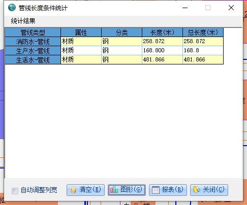

### 一、决策分析

`1. `横剖面分析
>概述：在地图上画一条辅助线，获取辅助线与管线的交点，求出各交点的地面高程、中心高程、管径、间距，把这些数据以点线的形式呈现在xy平面，辅助决策分析。

>操作步骤：
>+ 选择菜单栏横剖面分析命令
>+ 找到要进行横剖分析的管线
>+ 鼠标左键点击地图确定辅助线的起点
>+ 移动鼠标确定辅助线的终点
>+ 点击左键结束辅助线的绘制
>+ 程序弹出管线横断面图

>计算方法：  
>已知：  
> + 辅助线的几何对象(可以获取起点与终点坐标)
> + 所有管线的几何对象
> + 所有管线的起点埋深、终点埋深、起点高程、终点高程
>
>求解: 辅助线与管线相交点的坐标、中心高程、地面高程、管径、间距
> 
> 求解步骤：
> + 找到与辅助线相交的管线以及交点
> + 计算交点处的地面高程、中心高程、以及辅助线起点到交点的距离

`2. `纵剖面分析
>概述：计算并显示连续管线各节点的地面高程、管线高程、管径、间距

>操作步骤：
>+ 选择菜单栏纵剖面分析命令
>+ 找到要进行纵剖分析的连续管线
>+ 依次拉框选中要进行纵剖面分析的管线
>+ 单击鼠标右键，弹出计算结果图

>计算方法：  
>已知：
> + 所有选择的连续管线
> + 所有选择的连续管线的几何对象
> + 所有选择的连续管线的起点埋深、终点埋深、起点高程、终点高程
>
>求解: 连续管线各节点的地面高程、管线高程、管径、间距
>
> 求解步骤：
> + 进行规则判断(必须是连续管线、无法处理三通以及多通管线)
> + 依次找到连续管线的各节点信息（从起始点开始查找，依次查找后续节点）
> + 计算各节点的地面高程、中心高程以及各节点的间距

`3. `火灾抢险分析
>概述：在地图上以某一点为中心，画一个半径为r的圆，查找所画圆范围内给水管线中所有 附属物='消防栓' or 附属物='消火栓' or 附属物='消防井' 的管点，并显示出来

>操作步骤：
>+ 选择菜单栏火灾抢险分析命令
>+ 在地图上选择合适的点位置，点击鼠标左键
>+ 在弹出的对话框中，输入合适的半径，点击确定
>+ 地图上将显示半径范围内所有满足条件的管点
>+ 地图下方显示所有满足条件的管点的列表

>计算方法：  
>已知：
> + 圆点以及半径
> + 所有管线、管点的几何对象
> + 所有管线、管点的附属物、坐标值等信息
>
>求解: 指定圆范围内所有满足条件的管点，以及管点到圆心的距离
>
> 求解步骤：
> + 根据所画圆以及属性条件，通过arcMap接口找到所有满足条件的管点，并显示出来

`4. `爆管关阀分析
>概述：鼠标点击管线某一位置，通过所选管线查找最近的 "附属物='阀门井' or 附属物='阀门'" 并显示出来

>操作步骤：
>+ 选择菜单栏爆管关阀分析命令
>+ 在地图上选择出现爆管的点位置，点击鼠标左键
>+ 程序会查找并显示满足条件的阀门

>计算方法：  
>已知：
> + 出现爆管的位置，以及查询条件 "附属物='阀门井' or 附属物='阀门'"
>
>求解: 从爆管处开始找到最近的阀门或阀门井
>
> 求解步骤：
> + 根据爆管位置找到爆管管线
> + 依次查找连接管线起点或终点的其他管线
> + 直到找到最近的阀门或阀门井

`5. `垂直净距分析
>概述：拖动鼠标框选两根不同子类管线的交点处，会弹出两根管线的相关参数信息（只能框选一个交点）

>操作步骤：
>+ 选择菜单栏垂直净距分析命令
>+ 在地图上框选要进行分析的交点处
>+ 程序会显示出交点处两个管线垂直净距相关的参数信息

>计算方法：  
>已知：
> + 相交管线的大致位置，以及各管线的相关参数信息
>
>求解: 得到交点，并获取交点垂直净距相关的信息
>
> 求解步骤：
> + 求得管线交点
> + 计算交点垂直净距相关的参数信息

`6. `水平净距分析
>概述：拖动鼠标框选择要进行水平净距分析的管线

>操作步骤：
>+ 选择菜单栏水平净距分析命令
>+ 在地图上框选要进行水平净距分析的管线
>+ 单机鼠标右键，弹出所选管线的相关信息
>+ 点击下一步，选择另外一条管线
>+ 单机鼠标右键，弹出另外一条管线的相关信息
>+ 单机确定，弹出分析结果

>计算方法：  
>已知：
> + 要进行水平净距分析的两条管线，以及水平净距的标准值
>
>求解: 两条管线的水平净距，以及判断是否符合规范
>
> 求解步骤：
> + 计算管线的水平净距
> + 与规范值进行比较，得出结论

`7. `覆土深度分析
>概述：拖动鼠标画一条辅助线，与需要进行测量的管线相较于某点，计算交点处的埋深，埋深即覆土深度

>操作步骤：
>+ 选择菜单栏覆土深度分析命令
>+ 在地图上画出辅助线，得到要进行覆土深度分析的管线交点
>+ 计算交点处的埋深，在地图下方显示相关参数信息

>计算方法：  
>已知：
> + 要进覆土深度分析的位置
>
>求解: 此位置的管线埋深
>
> 求解步骤：
> + 计算出测量位置的相关位置信息
> + 再计算出测量位置的埋深

`8. `管线规划设计
>概述：创建一条管线，获取与新建管线相交管线的交点相关信息

>操作步骤：
>+ 选择菜单栏管线规划设计命令
>+ 绘制或输入新建管段的相关信息
>+ 显示与新建管线相交管线以及交点的相关信息

>计算方法：  
>已知：
> + 新建管线
>
>求解: 与新建管线相交的管线以及交点信息
>
> 求解步骤：
> + 查找与新建管线相交的管线及其交点信息

`9. `道路扩建分析
>概述：仅限于 交通设施-面 这个图层

`10. `范围拆迁分析
>概述：通过鼠标划定某一拆迁范围，求出范围内管线长度，以及设置数量和面积等

`11. `管线三维分析
>概述：通过鼠标划定某一范围，获取范围内管线相关参数，使用这些参数生成三维管线进行相关分析

`12. `地形三维分析
>概述：通过鼠标划定某一范围，获取范围内地形相关参数，使用这些参数生成三维地形进行相关分析

`13. `空间三维分析
>概述：通过鼠标划定某一范围，获取范围内管线与地形相关参数，使用这些参数生成三维管线以及地形进行相关分析

### 二、数据统计

`1. `全库管线长度统计
>概述：按所选管线某一属性的所有值，分类统计每个选择的管线种类的管线长度

>计算方法：
>+ 现有计算：select [材质] As F1,Sum([管段间距]) as F2 from [JSL] group by [材质]
>+ 重新计算：select A.材质 as F1,Sum(sqr((A.起点高程-A.终点高程)*(A.起点高程-A.终点高程)+(B.Y-C.Y)*(B.Y-C.Y)+(B.X-C.X)*(B.X-C.X))) AS F2 from (JSL as A inner join JSP as B on A.起始点号=B.物探点号) inner join JSP as C on A.终止点号=C.物探点号 Group BY A.材质

`2. `全库管点数量统计
>概述：按所选管点某一属性的所有值，分类统计每个选择的管线种类的管点数量

>计算方法：
>+ Select 特征 As F1,Count(*) As F2 From JSP Group By 特征

`3. `全库管线分类统计
>概述：按所选管线属性的所有值，分类统计每个选择的管线种类的管线长度

>计算方法：
> + 遍历选择的管线类别，遍历所选属性下的所有属性值
> + 查找某管线类别下满足某属性的某属性值的管线
> + 现有计算：累加所有管线的 管线间距 值，求得管线长度
> + 重新计算：利用每段管线的起点与终点x、y、高程值，通过两点间距离公式计算每段管线的长度

`4. `全库管点分类统计
>概述：按所选管点属性值的所有值，分类统计每个选择的管线种类的管点数量

>计算方法：
> + 遍历选择的管线类别，遍历所选属性下的所有属性值
> + 查找某管线类别下满足某属性的某属性值的管点
> + 累加获得管点数量

`5. `按管线材质统计
>概述：按所选管线材质属性的某一值，统计每个选择的管线种类的管线长度

>计算方法：
> + 遍历选择的管线类别，遍历所选属性下的所有属性值
> + 查找某管线类别下满足某属性的某属性值的管线,通过And连接,"材质 = '钢' And ([材质]='钢')"
> + 现有计算：累加所有管线的 管线间距 值，求得管线长度
> + 重新计算：利用每段管线的起点与终点x、y、高程值，通过两点间距离公式计算每段管线的长度

`6. `按管线管径统计
>概述：按所选管线管径属性的某一值，统计每个选择的管线种类的管线长度

>计算方法同上

`7. `按建设年代统计
>概述：按所选管线建设年代属性的某一值，统计每个选择的管线种类的管线长度

>计算方法同上

`8. `按权属单位统计
>概述：按所选管线权属单位属性的某一值，统计每个选择的管线种类的管线长度

>计算方法同上

`9. `按所在道路统计
>概述：按所选管线所在道路属性的某一值，统计每个选择的管线种类的管线长度

>计算方法同上

`10. `全库简单条件统计
>概述：统计所选某一类管线下某一属性的某一值的管线长度或管点数量

>计算方法：
> + 在当前选择的管线类别下，遍历所选属性下的所有属性值
> + 查找当前管线类别下满足某属性的某属性值的管线,通过And连接,"材质 = '钢' And ([材质]='钢')"
> + 现有计算：累加所有管线的 管线间距 值，求得管线长度
> + 重新计算：利用每段管线的起点与终点x、y、高程值，通过两点间距离公式计算每段管线的长度

`11. `全库复合条件统计
>概述：统计所选管线种类的满足一个或多个属性的属性值的管线长度

>计算方法：
> + 遍历所选管线类别，遍历所选属性下的所有属性值
> + 查找当前管线类别下满足某属性的某属性值的管线,通过And连接,"材质 = '钢' And ([材质]='钢')"
> + 现有计算：累加所有管线的 管线间距 值，求得管线长度
> + 重新计算：利用每段管线的起点与终点x、y、高程值，通过两点间距离公式计算每段管线的长度

`12. `区域内管线长度统计
>概述：区域内管线，按所选管线某一属性的所有值，分类统计每个选择的管线种类的管线长度

`13. `区域内管点数量统计
>概述：区域内管点，按所选管点某一属性的所有值，分类统计每个选择的管线种类的管点数量

`14. `区域内复合条件统计
>概述：区域内管线，统计所选管线种类的一个或多个属性的属性值的管线长度

 
